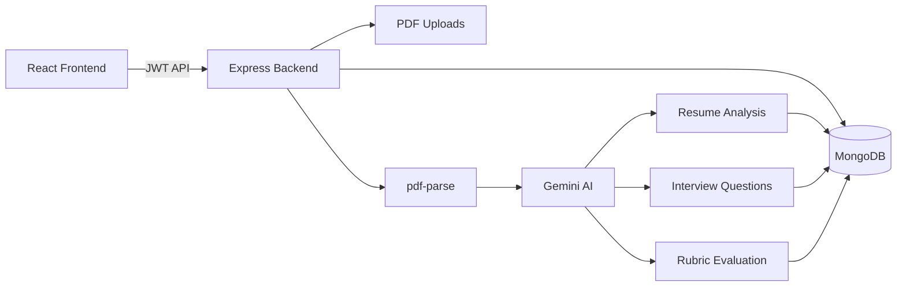

<div align="center">

# HireSense AI

**AI-powered interview preparation platform — upload your resume, get analyzed, practice mock interviews, and receive rubric-based feedback.**

[](https://github.com/KnightByte-IO/HireSense-AI)
[](https://react.dev/)
[](https://nodejs.org/)
[](https://ai.google.dev/)

[Live Demo](#) · [Report Bug](https://github.com/KnightByte-IO/HireSense-AI/issues) · [Request Feature](https://github.com/KnightByte-IO/HireSense-AI/issues)

</div>

---

## Overview

**HireSense AI** helps candidates prepare for real interviews using their own resume. Upload a PDF, let Gemini extract skills and experience, generate personalized interview questions, answer them in a guided UI, and get an AI performance report with scores, strengths, weaknesses, and ideal answers.

> Built for portfolio projects, hackathons, and interview prep — clean MERN architecture, beginner-friendly code, production-ready patterns.

---

## Features

| Module | What it does |
|--------|----------------|
| **Authentication** | Register, login, JWT-protected routes |
| **Dashboard** | Resume stats, analysis status, interview performance |
| **Resume Upload** | PDF upload via Multer → stored on disk + MongoDB |
| **Resume Analysis** | `pdf-parse` extracts text → Gemini returns skills, education, projects |
| **AI Interview** | 10 personalized questions (Technical + Behavioral, Easy/Medium/Hard) |
| **Answer Submission** | Step-by-step save per question |
| **AI Evaluation** | Rubric scoring: relevance, accuracy, depth, clarity |
| **Results Report** | Score cards, skill-wise analysis, ideal answers, recommendation |
| **Local Fallback** | Rule-based scoring when Gemini API is unavailable |

---

## Architecture



### End-to-end flow

```
Register → Login → Upload PDF → Analyze Resume → Start AI Interview
    → Answer 10 Questions → AI Evaluation → Performance Report → Dashboard
```

---

## Tech Stack

### Frontend
- **React 18** + **Vite**
- **Tailwind CSS** — dark UI, cards, progress bars
- **React Router** — protected routes
- **Axios** — API client with JWT interceptor

### Backend
- **Node.js** + **Express.js**
- **MongoDB** + **Mongoose**
- **JWT** + **bcrypt** — authentication
- **Multer** — PDF file upload
- **pdf-parse** — text extraction
- **@google/genai** — Gemini API (resume analysis, questions, evaluation)

---

## Project Structure

```
HireSense-AI/
├── backend/
│   ├── config/              # MongoDB connection
│   ├── controllers/         # HTTP handlers (auth, resume, interview)
│   ├── middleware/          # JWT auth, upload, errors
│   ├── models/              # User, Resume, Interview schemas
│   ├── routes/              # API routes
│   ├── services/            # Business logic + Gemini services
│   ├── scripts/             # testPdfParse, testGeminiKey
│   ├── uploads/             # PDF storage (gitignored)
│   ├── app.js
│   └── server.js
│
└── frontend/
    └── src/
        ├── components/      # Layout, Navbar, ProtectedRoute
        ├── context/           # AuthContext
        ├── pages/             # Home, Login, Dashboard, Interview...
        └── services/          # api.js
```

---

## Getting Started

### Prerequisites

- **Node.js** 18+
- **MongoDB** (local or [MongoDB Atlas](https://www.mongodb.com/atlas))
- **Gemini API key** from [Google AI Studio](https://aistudio.google.com/apikey)

### 1. Clone the repository

```bash
git clone https://github.com/KnightByte-IO/HireSense-AI.git
cd HireSense-AI
```

### 2. Backend setup

```bash
cd backend
npm install
cp .env.example .env
```

Edit `backend/.env`:

```env
PORT=5000
MONGO_URI=mongodb://127.0.0.1:27017/hiresense-ai
JWT_SECRET=your_super_secret_key
GEMINI_API_KEY=your_gemini_api_key
GEMINI_MODEL=gemini-2.5-flash-lite
EVALUATION_MODE=auto
```

Start the server:

```bash
npm run dev
```

API runs at **http://localhost:5000**

### 3. Frontend setup

```bash
cd frontend
npm install
```

Create `frontend/.env`:

```env
VITE_API_URL=http://localhost:5000
```

Start the app:

```bash
npm run dev
```

App runs at **http://localhost:5173**

---

## API Reference

### Auth

| Method | Endpoint | Description |
|--------|----------|-------------|
| `POST` | `/api/auth/register` | Register user |
| `POST` | `/api/auth/login` | Login → JWT token |

### Resume

| Method | Endpoint | Description |
|--------|----------|-------------|
| `POST` | `/api/resume/upload` | Upload PDF (protected) |
| `POST` | `/api/resume/analyze/:resumeId` | Parse PDF + Gemini analysis |
| `GET` | `/api/resume/me` | Get latest resume |
| `GET` | `/api/resume/me/summary` | Dashboard stats |

### Interview

| Method | Endpoint | Description |
|--------|----------|-------------|
| `POST` | `/api/interview/generate` | Generate 10 AI questions |
| `GET` | `/api/interview/:interviewId` | Get interview session |
| `POST` | `/api/interview/:interviewId/answer` | Save answer |
| `POST` | `/api/interview/:interviewId/evaluate` | Run AI evaluation |
| `GET` | `/api/interview/:interviewId/results` | Get evaluation report |
| `GET` | `/api/interview/me/summary` | Performance dashboard data |

---

## Evaluation Rubric

Each interview answer is scored **0–100** on four dimensions:

| Dimension | Weight | Criteria |
|-----------|--------|----------|
| Relevance | 25 pts | Does the answer address the question? |
| Accuracy | 25 pts | Technically / behaviorally correct? |
| Depth | 25 pts | Examples, reasoning, STAR method |
| Clarity | 25 pts | Clear, structured communication |

Penalties apply for off-topic, empty, or incorrect answers. Long irrelevant answers do **not** get high scores.

---

## Scripts

```bash
# Backend
cd backend
npm run dev          # Start with nodemon
npm start            # Production start
npm run test:pdf     # Test PDF parsing
npm run test:gemini  # Test Gemini API key

# Frontend
cd frontend
npm run dev          # Dev server
npm run build        # Production build
```

---

## Environment Variables

| Variable | Description |
|----------|-------------|
| `PORT` | Backend port (default `5000`) |
| `MONGO_URI` | MongoDB connection string |
| `JWT_SECRET` | Secret for signing tokens |
| `GEMINI_API_KEY` | Google Gemini API key |
| `GEMINI_MODEL` | Model name (e.g. `gemini-2.5-flash-lite`) |
| `EVALUATION_MODE` | `auto` \| `gemini` \| `local` |
| `VITE_API_URL` | Frontend → backend URL |

> Never commit `.env` files. Use `.env.example` as a template.

---

## Interview Explanation (30 sec pitch)

> "HireSense AI is a MERN app where users upload a PDF resume. The backend uses Multer for storage, pdf-parse for text extraction, and Gemini to extract skills and experience. Based on that analysis, Gemini generates 10 personalized interview questions. Users answer one-by-one; each answer is evaluated with a strict rubric across relevance, accuracy, depth, and clarity. Results are saved in MongoDB and shown on a performance dashboard with scores, strengths, weaknesses, and ideal answers."

---

## Roadmap

- [ ] Deploy to Render / Vercel
- [ ] Interview history page
- [ ] Profile settings
- [ ] Voice-based mock interview
- [ ] PDF export of evaluation report

---

## Contributing

1. Fork the repo
2. Create a feature branch (`git checkout -b feature/amazing-feature`)
3. Commit changes (`git commit -m 'Add amazing feature'`)
4. Push to branch (`git push origin feature/amazing-feature`)
5. Open a Pull Request

---

## License

ISC

---

<div align="center">

**Built with MERN + Gemini AI**

[GitHub](https://github.com/KnightByte-IO/HireSense-AI) · KnightByte-IO

</div>
